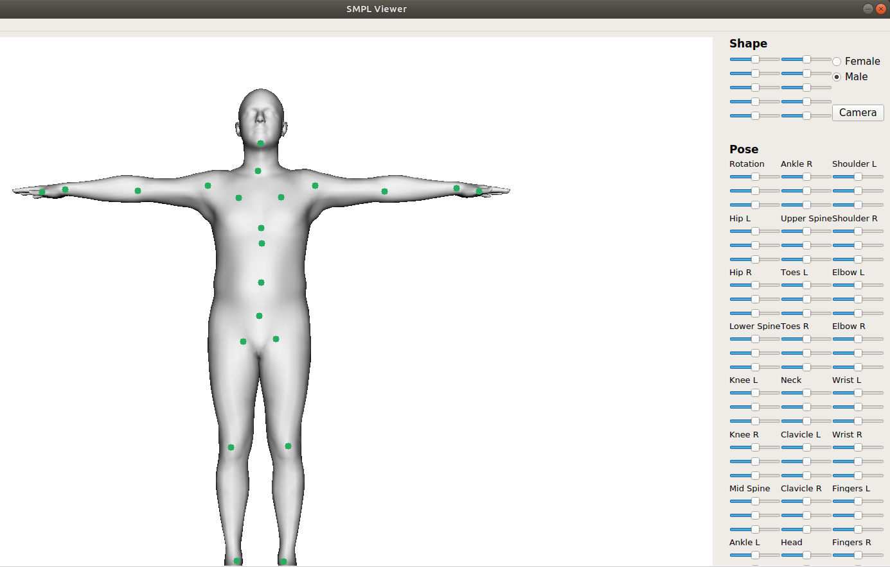

# smpl_viewer工程配置

pyqt5要安装这个，其他的会有问题 <https://anaconda.org/dsdale24/pyqt5>

```shell
$conda install -c dsdale24 pyqt5 

$conda install -c conda-forge opencv

$conda install numpy

$conda install scipy
```

以及Cython、chumpy、opendr的手动安装

